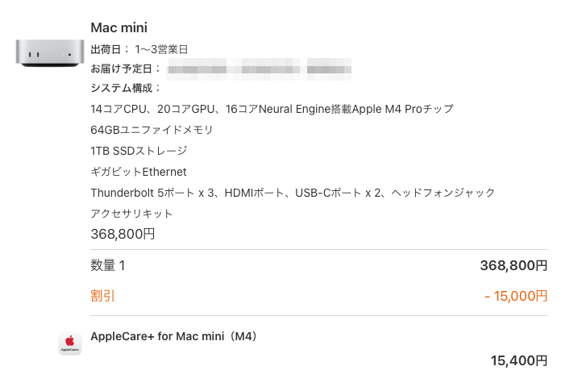

# llm-translator-rust

Русский | [English](README.md) | [日本語](README.ja.md) | [中文](README.cn.md) | [Français](README.fr.md) | [Deutsch](README.ge.md) | [Italiano](README.it.md) | [한국어](README.kr.md) | [UK English](README.uk.md)

Небольшой CLI‑переводчик на базе LLM tool‑calls, который всегда читает ввод из stdin.

## Contents

- [Overview](#overview)
- [Installation](#installation)
- [Quickstart](#quickstart)
- [Alias (`t`) for CLI usage](#alias-t-for-cli-usage)
- [Usage](#usage)
- [Model selection & cache](#model-selection--cache)
- [Settings](#settings)
- [Language Packs](#language-packs)
- [Environment variables](#environment-variables)
- [Options](#options)
- [Server mode](#server-mode)
- [FFI (C ABI)](#ffi-c-abi)
- [Notes](#notes)

## Overview

- Читает ввод из stdin и выводит перевод.
- Использует только JSON для tool‑calls (без свободного текста).
- Провайдеры: OpenAI, Gemini, Claude.
- Список моделей берётся через Models API каждого провайдера и кэшируется на 24 часа.

## Installation

Выберите один из вариантов:

### 1) Скачать из GitHub Releases

Артефакты релизов доступны на странице Releases:
[GitHub Releases](https://github.com/m3m0r7/llm-translator-rust/releases/latest)

Каждый файл называется `llm-translator-rust-<os>-<arch>` (например, `llm-translator-rust-macos-aarch64`).

### 2) Установить через cargo (глобально)

```bash
cargo install --git https://github.com/m3m0r7/llm-translator-rust --locked
```

### 3) Собрать из исходников (git clone)

```bash
git clone https://github.com/m3m0r7/llm-translator-rust
cd llm-translator-rust
make install
```

Бинарник будет здесь:

```
./target/release/llm-translator-rust
```

Примечания:
- macOS/Linux по умолчанию: `/usr/local/bin` (используйте `sudo make install`, если нужно)
- Windows (MSYS/Git Bash): `%USERPROFILE%/.cargo/bin`
- `make install` также копирует `settings.toml` в `~/.llm-translator-rust/settings.toml`, если файла нет

## Quickstart

```bash
export OPENAI_API_KEY="..."
./target/release/llm-translator-rust <<< "ねこ"
```

## Alias (`t`) for CLI usage

```bash
alias t="/path/to/llm-translator-rust/target/release/llm-translator-rust"

echo ねこ | t
```

## Usage

```bash
echo Cat | llm-translator-rust

echo Cat | llm-translator-rust -l en

echo Cat | llm-translator-rust --source-lang en -l ja

# Output examples
echo Cat | llm-translator-rust
# Cat

echo Cat | llm-translator-rust -l en
# Cat

echo Cat | llm-translator-rust -l kor
# 고양이

echo Cat | llm-translator-rust -l zho-hans
# 猫

echo Cat | llm-translator-rust -l zho-hant
# 貓

echo Cat | llm-translator-rust -l ja --formal academic
# 猫

echo Awesome | llm-translator-rust -l ja --slang
# ヤバい

# Dictionary (part of speech/inflections)
echo 猫 | llm-translator-rust --pos -l en

# File translation
cat foobar.txt | llm-translator-rust -l en

# File attachment translation (image/doc/docx/pptx/xlsx/pdf/txt/md/html/json/yaml/po/xml/js/ts/tsx/mermaid/audio)
llm-translator-rust --data ./slides.pptx --data-mime pptx -l en
llm-translator-rust --data ./scan.png -l ja
llm-translator-rust --data ./voice.mp3 -l en

# Attachment via stdin (auto-detect or with --data-mime)
cat ./scan.png | llm-translator-rust -l ja
cat ./report.pdf | llm-translator-rust --data-mime pdf -l en

# Image/PDF attachments are re-rendered with numbered overlays (path is returned).
# The image height is extended and a footer list is added:
# (N) original (reading): translated
# - reading is a Latin-script pronunciation for non-Latin text (e.g., romaji/pinyin).
# - identical translations share the same number.
# When using --data with a file path (and without --overwrite), a sibling file is written.
# The suffix comes from settings.toml [system].translated_suffix (default: _translated).
# When --data points to a directory, a sibling output directory is created with the same suffix.
```

## Directory translation

Когда `--data` указывает на директорию, CLI рекурсивно проходит её и переводит каждый поддерживаемый файл.
Относительная структура каталогов сохраняется в выходной директории.

```bash
llm-translator-rust --data ./docs -l ja
# Output: ./docs_translated (default suffix; configurable via settings.toml)
```

Примечания:
- `--data-mime` применяется ко всем файлам в директории; при смешанных типах оставьте `auto`.
- Файлы, которые нельзя прочитать или у которых не удаётся определить MIME, отмечаются как ошибки; неподдерживаемые пропускаются.
- Используйте `--force`, чтобы трактовать неизвестные/низкоуверенные типы как текст.
- Перевод директории идёт параллельно (по умолчанию 3 потока). Настраивается через `--directory-translation-threads` или `settings.toml`.
- Исключения через `--ignore-translation-file` или ignore‑файл (по умолчанию `.llm-translation-rust-ignore`, настраивается в `settings.toml`).
  Правила совместимы с `.gitignore` (`*`, `**`, `!`, комментарии).
- Игнор‑правила действуют только когда `--data` — директория.
- Используйте `--out` для выбора выходной директории.
- При ошибке перевода директории исходный файл копируется в выходную директорию.

## Overwrite mode (--overwrite)

`--overwrite` перезаписывает файлы/директории, переданные через `--data`.
Перед записью каждый файл сохраняется в `~/.llm-translated-rust/backup`.
Срок хранения задаётся в `settings.toml` `[system].backup_ttl_days` (по умолчанию 30).

```bash
llm-translator-rust --data ./docs --overwrite -l ja
llm-translator-rust --data ./slide.pdf --overwrite -l en
```

## Output path (--out)

`--out` задаёт путь вывода для переводов файлов или директорий.
Нельзя использовать вместе с `--overwrite`.

```bash
llm-translator-rust --data ./docs -l ja --out ./outdir
llm-translator-rust --data ./slide.pdf -l en --out ./translated.pdf
```

## Dictionary (--pos)

`--pos` возвращает словарные сведения о вводимом слове.

Использование:

```
echo 猫 | llm-translator-rust --pos -l en
```

Пример вывода (метки соответствуют языку исходника):

```
訳語: cat
読み: キャット
品詞: 名詞
属性: 動物, ペット
別訳: kitty (キティ), tomcat (トムキャット), feline (フィーライン)

複数形: cats
三人称単数: cats
過去形: -
現在分詞: -

用法: 一般的な猫を指す最も基本的な言葉。ペットや動物全般として広く使われる。
用例:
- I have a cat. (私は猫を飼っています。)
- The black cat is sleeping. (黒い猫が眠っています。)
- Many people love cats. (多くの人が猫を愛しています。)
```

## Correction (--correction)

`--correction` выполняет проверку текста и выдаёт замечания на языке исходника.

Использование:

```
echo "This is pen" | llm-translator-rust --correction --source-lang en
```

Пример вывода:

```
This is a pen
        -

Correction reasons:
- English requires a/an before a countable noun
```

- Метки локализуются под язык исходника.
- `Reading` — произношение перевода в типичном письме языка источника.
- `Alternatives` — альтернативные варианты перевода с чтением.
- `Usage` и исходные предложения примеров — на языке источника.
- Примеры содержат перевод или один из альтернативных вариантов.

## Audio translation

Аудиофайлы транскрибируются через `whisper-rs`, переводятся LLM и заново синтезируются.

- Поддержка аудио: mp3, wav, m4a, flac, ogg
- Требуется `ffmpeg`
- Требуется модель Whisper (скачивается при первом запуске)
- TTS использует macOS `say` или Linux `espeak`

Выбор модели:

```
llm-translator-rust --show-whisper-models
llm-translator-rust --whisper-model small -d ./voice.mp3 -l en
```

Можно также задать `LLM_TRANSLATOR_WHISPER_MODEL` (имя модели или путь).
`settings.toml` `[whisper] model` или `--whisper-model` имеют приоритет.

## Dependencies

macOS (Homebrew):

```
brew install tesseract ffmpeg
```

Ubuntu/Debian:

```
sudo apt-get install tesseract-ocr ffmpeg espeak
```

Windows (Chocolatey):

```
choco install tesseract ffmpeg
```

## Image translation example

Original:



Translated:


## Model selection & cache

- Приоритет провайдеров по умолчанию: OpenAI → Gemini → Claude (первая найденная API‑ключ).
- `-m/--model` принимает:
  - Только провайдер: `openai`, `gemini`, `claude`
  - Провайдер + модель: `openai:MODEL_ID`
  - При явном указании модели всегда используйте префикс провайдера.
- По умолчанию используется модель провайдера; если недоступна — первая совместимая с чатом.
- Языки источника/назначения — ISO 639-1 или ISO 639-2/3 (например, `ja`, `en`, `jpn`, `eng`). Источник может быть `auto`.
- Китайские варианты: `zho-hans` (упрощённый) или `zho-hant` (традиционный).
- Проверка языков использует список ISO 639 на Wikipedia: https://en.wikipedia.org/wiki/List_of_ISO_639_language_codes
- Список моделей кэшируется на 24 часа.
- Путь кэша:
  - `~/.llm-translator/.cache/meta.json` (fallback: `./.llm-translator/.cache/meta.json`)
- `--show-models-list` печатает список `provider:model` построчно.
- `--show-whisper-models` показывает доступные модели whisper.
- `--pos` возвращает словарные детали.
- `--correction` возвращает исправления и причины на языке источника.
- `--whisper-model` выбирает модель транскрибации аудио.
- Если `--model` не задан, используется `lastUsingModel` из `meta.json`.
- История хранится в `meta.json`. Выходные файлы пишутся в `~/.llm-translator-rust/.cache/dest/<md5>`.
- Изображения/PDF используют OCR (tesseract), нормализуют текст через LLM и перерисовывают нумерованный оверлей + список внизу.
- Office‑файлы (docx/xlsx/pptx) переписываются путём перевода текстовых узлов XML.
- MIME вывода соответствует MIME входа.
- Языки OCR выводятся из `--source-lang` и `--lang`.
- `tesseract --list-langs` показывает установленные языки OCR.
- PDF OCR требует рендерер (`mutool` или `pdftoppm` из poppler).
- PDF вывод растеризуется (текст становится невыделяемым).

Provider defaults:
- OpenAI: `openai:gpt-5.1`
- Gemini: `gemini:gemini-2.5-flash`
- Claude: `claude:claude-sonnet-4-5-20250929`

Provider model APIs:
- [OpenAI Models API](https://platform.openai.com/docs/api-reference/models)
- [Gemini Models API](https://ai.google.dev/api/models)
- [Anthropic Models API](https://docs.anthropic.com/en/api/models)

## Settings

Порядок загрузки файлов настроек (сверху — выше приоритет):

1. `~/.llm-translator-rust/settings.local.toml`
2. `~/.llm-translator-rust/settings.toml`
3. `./settings.local.toml`
4. `./settings.toml`

Можно передать `-r/--read-settings` для загрузки дополнительного локального TOML (самый высокий приоритет).

Формат `settings.toml`:
`system.languages` должны быть ISO 639-3.

```toml
[system]
languages = ["jpn", "eng", ...]
histories = 10
directory_translation_threads = 3
translation_ignore_file = ".llm-translation-rust-ignore"

[formally]
casual = "Use casual, natural everyday speech."
formal = "Use polite, formal register suitable for professional contexts."
...

[ocr]
text_color = "#c40000"
stroke_color = "#c40000"
fill_color = "#ffffff"
normalize = true
# font_size = 18
# font_family = "Hiragino Sans"
# font_path = "/System/Library/Fonts/Hiragino Sans W3.ttc"
```

## Language Packs

Языковые пакеты находятся в `src/languages/<iso-639-3>.toml`.
Первая запись в `system.languages` используется для отображения меток в `--show-enabled-languages`.

Пример (Japanese):

```toml
[translate.iso_country_lang.jpn]
jpn = "日本語"
eng = "英語"

```

## Environment variables

- OpenAI: `OPENAI_API_KEY`
- Gemini: `GEMINI_API_KEY` или `GOOGLE_API_KEY`
- Claude: `ANTHROPIC_API_KEY`

`-k/--key` переопределяет переменные окружения.

## Options

| Flag | Long | Description | Default |
| --- | --- | --- | --- |
| `-l` | `--lang` | Язык назначения | `en` |
| `-m` | `--model` | Выбор провайдера/модели | (auto) |
| `-k` | `--key` | Переопределить API‑ключ | (env) |
| `-f` | `--formal` | Ключ стиля (из `settings.toml` `[formally]`) | `formal` |
| `-L` | `--source-lang` | Язык источника (ISO 639-1/2/3 или `auto`) | `auto` |
| `-s` | `--slang` | Использовать сленг при необходимости | `false` |
| `-d` | `--data` | Файл‑вложение (image/doc/docx/pptx/xlsx/pdf/txt/md/html/json/yaml/po/xml/js/ts/tsx/mermaid/audio) |  |
| `-M` | `--data-mime` | MIME для `--data` (или stdin) | `auto` |
|  | `--with-commentout` | Переводить комментарии (HTML/YAML/PO) |  |
|  | `--show-enabled-languages` | Показать доступные языки |  |
|  | `--show-enabled-styles` | Показать стили |  |
|  | `--show-models-list` | Показать список моделей из кэша |  |
|  | `--show-whisper-models` | Показать доступные модели whisper |  |
|  | `--pos` | Словарный вывод (части речи/формы) |  |
|  | `--correction` | Проверка и замечания по тексту |  |
|  | `--show-histories` | Показать историю переводов |  |
|  | `--with-using-tokens` | Добавить использование токенов |  |
|  | `--with-using-model` | Добавить имя модели |  |
|  | `--force` | Форсировать перевод как текст при неопределённом MIME |  |
|  | `--debug-ocr` | OCR‑debug оверлеи/JSON |  |
|  | `--whisper-model` | Модель Whisper (имя или путь) |  |
|  | `--overwrite` | Перезаписать входные файлы (backup в `~/.llm-translated-rust/backup`) |  |
|  | `--directory-translation-threads` | Параллелизм для директорий |  |
|  | `--ignore-translation-file` | Исключения для перевода директорий (gitignore‑style) |  |
| `-o` | `--out` | Путь вывода |  |
|  | `--verbose` | Подробные логи |  |
| `-i` | `--interactive` | Интерактивный режим |  |
| `-r` | `--read-settings` | Прочитать дополнительный TOML |  |
|  | `--server` | Запустить HTTP‑сервер (`ADDR` по умолчанию: settings или `0.0.0.0:11223`) |  |
| `-h` | `--help` | Справка |  |

## Server mode

Запуск HTTP‑сервера:

```bash
llm-translator-rust --server
llm-translator-rust --server 0.0.0.0:11223
```

Настройки сервера в `settings.toml` `[server]`:

```toml
[server]
host = "0.0.0.0"
port = 11223
tmp_dir = "/tmp/llm-translator-rust"
```

Запросы JSON `POST /translate` (`text` или `data`):

```json
{
  "text": "Hello",
  "lang": "ja"
}
```

```json
{
  "data": "/path/to/file-or-dir",
  "data_mime": "auto",
  "lang": "ja",
  "force_translation": false
}
```

Запрос коррекции:

```json
{
  "text": "This is pen",
  "correction": true,
  "source_lang": "en"
}
```

Ответ (текст):

```json
{
  "contents": [
    {
      "mime": "text/plain",
      "format": "raw",
      "original": "Hello",
      "translated": "こんにちは"
    }
  ]
}
```

Ответ коррекции (текст):

```json
{
  "contents": [
    {
      "mime": "text/plain",
      "format": "raw",
      "original": "This is pen",
      "translated": "This is a pen",
      "correction": {
        "markers": "        -",
        "reasons": ["English requires a/an before a countable noun"],
        "source_language": "en"
      }
    }
  ]
}
```

Ответ (бинарный):

```json
{
  "contents": [
    {
      "mime": "image/png",
      "format": "path",
      "translated": "/tmp/llm-translator-rust/llm-translator-xxxx.png"
    }
  ]
}
```

Если `data` — директория, в `contents` будет несколько записей.

## FFI (C ABI)

- C‑хедер: `ext/llm_translator_rust.h`.
- Функции возвращают строки в куче; освобождайте через `llm_ext_free_string`.
- При ошибке используйте `llm_ext_last_error_message`.

## Notes

- Ошибки API (включая нехватку квоты) возвращаются как есть.
- Используйте `-h/--help` для актуального списка опций.

## Formality values (default settings)

- `casual`: повседневный тон
- `formal`: вежливый формальный тон
- `loose`: свободная, расслабленная манера
- `academic`: академический стиль
- `gal`: игривый стиль gyaru/gal
- `yankee`: грубоватый «хулиганский» стиль
- `otaku`: отаку‑дикция и оттенки
- `elderly`: мягкий, уважительный тон
- `aristocrat`: изысканный «аристократический» тон
- `samurai`: архаичный «самурайский» стиль
- `braille`: вывод в Unicode‑брайлевском шрифте
- `morse`: вывод международного кода Морзе
- `engineer`: точный технический стиль
